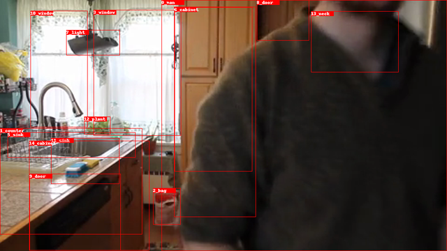
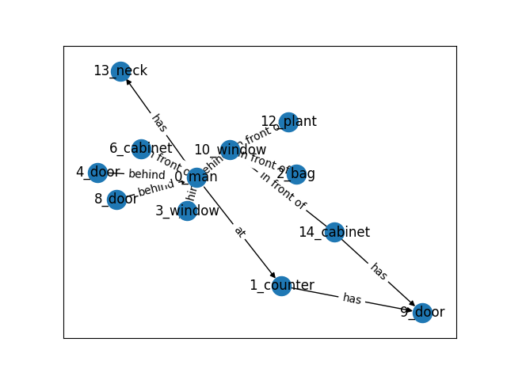

# Scene Graph Classification


## 1. Overview

### 1.1 Node Prediction

First we need any object detection model in order to detect the the objects in a image and to generate bounding boxes and labels (Faster R-CNN or Mask R-CNN). 

[LINK: Object Detection Benchmark ](https://github.com/facebookresearch/maskrcnn-benchmark)




### 1.2 Edge Prediction

 Using the objects as nodes, we apply a scene graph model to predict the relationships between any two nodes as the edges. For example, has, behind, on. etc are some possible relationships for nodes.

[LINK: Scene Graph Benchmark ](https://github.com/KaihuaTang/Scene-Graph-Benchmark.pytorch)

 


 ### 1.3 Generated Graphs Preprocessing

Using the generated graphs, we can implement preprocessing to simplify relationships or convert them into a suitable format for subsequent steps. For example, we can employ graph compression. This technique reconstructs each original full graph into a more compact representation. Effective graph compression not only aids in simplifying visualization but also distinctly represents the high-level structure of vast graph datasets. Furthermore, graph compression can enhance performance in downstream tasks, such as graph classification across action labels.

 [Graph Autoencoder for Graph Compression and Representation Learning (2021)](https://openreview.net/forum?id=Bo2LZfaVHNi)


 ### 1.4 Classification

Finally, we can utilize a graph classification model and assign labels to every image or generated graph, e.g., “using the phone.” This allows us to train a classification model using the generated and preprocessed graphs from the previous example.

[Semi-Supervised Classification with Graph Convolutional Networks (2017)](https://arxiv.org/abs/1609.02907)

## 2. Installation

Before you start follow the instructions on the [INSTALL.md](./INSTALL.md)


## 3. Dataset

For our expirements we use a subset of the Action Genome dataset. For all the frames of the selected subset of Action Genome, we have a file with annotations. 

``` 
datasets/ActionGenome/anno_frames_bicls  
datasets/ActionGenome/anno_frames_bicls/custom_data_info.json
datasets/ActionGenome/anno_frames_bicls/scene_validation_annotations.json
```

## 4. Pipelines

We follow the pipeline from the [Scene Graph Generation, Compression, and Classification on Action Genome Dataset](https://medium.com/stanford-cs224w/scene-graph-generation-compression-and-classification-on-action-genome-dataset-9f692a1d5394) but we also try to direct train a Graph Sage classifier without compression. 


### 4.1 Common Step

#### 4.1.1 Generate graphs
We use a pretrained Scene Graph Benchmark in order to generate the scene graphs for our Dataset.
```
./generate_graphs.sh
```
The script generates a json file with the scene graph information. The file is a dictionary containing bbox(sorted), bbox_labels(sorted), bbox_scores(sorted), rel_pairs(sorted), rel_labels(sorted), rel_scores(sorted), rel_all_scores(sorted), where the last rel_all_scores give all 51 predicates probability for each pair of objects.
The dataset information is saved as custom_data_info.json in the same DETECTED_SGG_DIR.
```
datasets/ActionGenome/anno_frames_bicls/custom_prediction.json
```
#### 4.1.2 Visualize Graphs

We can use the SG-Visualazation notebook in order to visulize the graphs and the predictions.

```
SG-Visualazation.ipynb
```


### 4.2 Original pipeline

#### 4.2.1 Convert to PyG TUDataset
Our custome dataset converted to the same format of PyG TUDataset.

```
./convert_to_pyg_dataset.sh
```
#### 4.2.2 Compression
We apply Scene Graph Compression using the Multi-kernel Inductive Attention Graph Autoencoder (MIAGAE) proposed by [Graph Autoencoder for Graph Compression and Representation Learning (Yunhao G. 2021)](https://openreview.net/pdf?id=Bo2LZfaVHNi).

```
./prepare_compression.sh
./train_compression.sh
```

#### 4.2.3 Train classifier and Evaluate
```
./train_classification.sh
```

### 4.3 Alternative pipeline

#### 4.3.1 Preprocces - Train - Evaluate
In this notebook, we aim to directly train a GraphSAGE classifier. We load the generated graphs and convert them into a PyTorch Geometric dataset. Subsequently, we partition the data for training and evaluation, and then proceed with the training and evaluation process. 
```
Graph-SAGE-Test.ipynb
```

## 5. Results 

In both pipelines, the classifier underperforms. This could be due to various factors such as the dataset's scene labels, an unsuitable classifier architecture, or suboptimal model hyperparameters. In the main pipeline, we achieved a Test Accuracy of 0.533, while in the second pipeline, which doesn't employ compression, the Test Accuracy stands at 0.525. The primary purpose of this repository is to demonstrate a pipeline for Graph Scene Classification. Further work is needed to optimize performance.